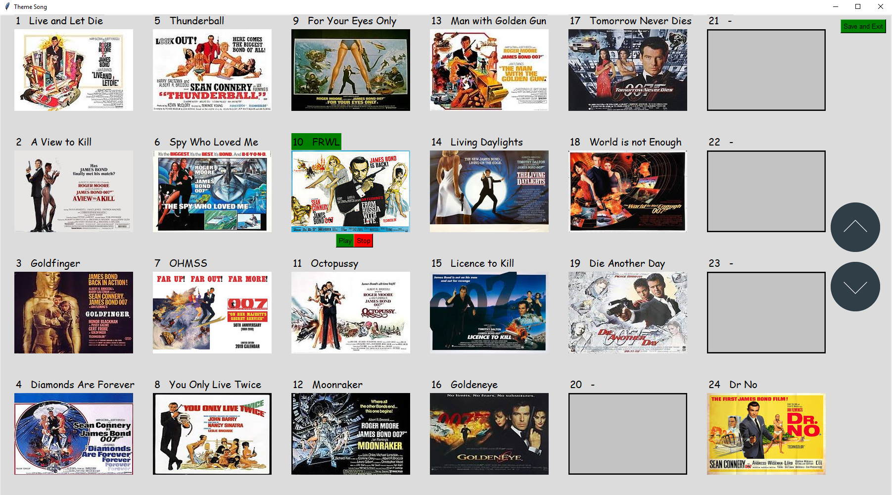

# Movie Ranker
This is a program to make it easy to rank movies during marathons. Useful for big marathons with a lot of movies where you want to gamify it a little to make it seem like you are being more productive than you are.
Especially good for multi-day marathons (ie. split over multiple sessions).

## App Views:
### UI

The main screen shows the current ordering of movies in the various categories. You can drag the movies into different positions.
<Names>: Switch to another person by clicking their name.
* Average: Shows the average placing of each movie (see below).
* Recap: Makes it easy to remember previous movies (see below).
* Add Next Movie: Adds the next movie after you have seen it (so you don't see spoilers when viewing recaps)
* Remove Last: Remove the last added movie
* Save/Load: Save or load previous sessions. Note: Autosave happens during any interaction.
* Toggle: Switch from colour seperation of 'seen movies' vs 'next movies', to custom seperation (see settings)

Average spot for each movie. Colours are uniqe to each movie, and you can shuffle the colours by clicking 'Average' again. The colours will work hard to be unique to each other.

Toggle: Switch to custom colour viewin

This switches to custom colour view (see settings). Useful if you want to seperate movies in some way, ie. with the Bond movies these are seperated by actor.

This is the recap view. Let's you see a recap of each movie in each category. This is showing the James Bond 'Villians' screen.
Select the active movie by clicking it, then hover mouse over an arrow and scroll (or click) to adjust the position.
*Save and Quit: Saves the order and exits.

This shows another varient for recap, which includes mp3's. You can add mp3's to the category folder and it will detect.
As before change the order, and play/stop the theme for the selected movie by clicking on the buttons.

## Settings
/settings/
All .txt files are seperated by line.
* categories.txt     Name for each category (exactly 6)
* movies_custom_colours.txt      The custom colours for each movie (hex). Line 1 corresponds to line 1 in (movies_seen+movies_next)
* movies_next.txt     Movies that you are watching this session
* movies_next.txt     Movies (if any) you watched last session
* persons.txt         Names of each player (max 12)

Six categories. Fill each folder with a number of images named 'a' to 'z'. This number must match the number of movies loaded into settings.
eg. a.jpg corresponds to the first movie in settings (movies_seen+movies_next)
You need an image for each movie.

the png's in this folder are used for recap screens. They need to stay.

To make this an mp3 folder, simply add a subfolder inside called 'mp3' and add your mp3's named as per the images ie. a.mp3, b.mp3 etc

## Save
/save/
Folder for all the saves. A manual save will save as yyyymmdd-hhmmss.txt, and an Auto Save will write over auto_save.txt